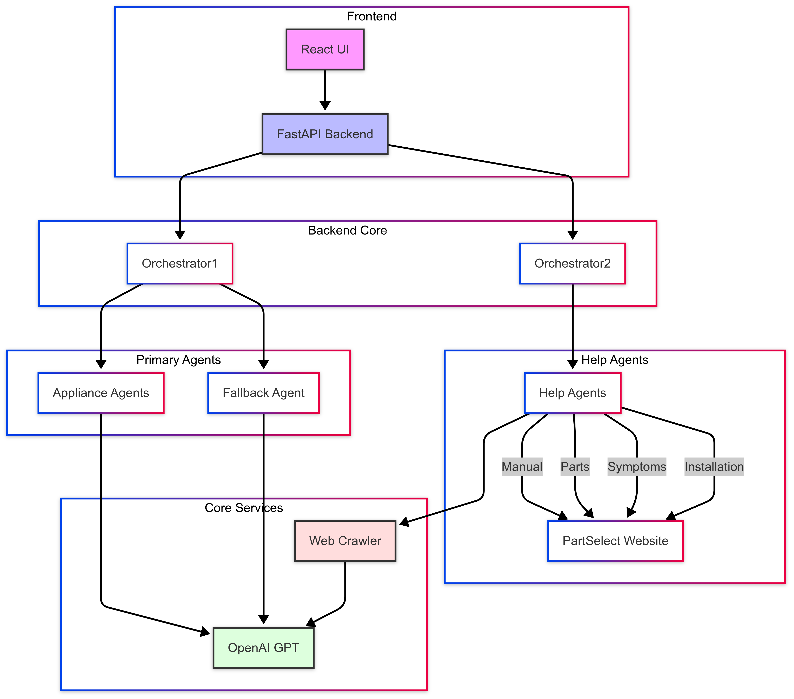

# PartSelect AI Assistant

An intelligent multi-agent system for appliance troubleshooting, specializing in refrigerators and dishwashers.

## 🌟 Features

- 🤖 Intelligent conversation handling with context awareness
- 🔍 Real-time parts and manual lookup
- 🛠️ Advanced symptom diagnosis
- 📚 Installation guidance
- 🌐 Dynamic web scraping with caching
- 💬 Modern, responsive chat interface

## ⚠️ Current Limitations

Please note that the following features are currently under development:
- Symptom diagnosis functionality (Looking for help with a problem/symptoms in the product)
- Installation information service

We are actively working on implementing these features. Currently, the following services are fully functional:
- Product manual/care guide lookup
- Parts search and identification

## 🏗️ Architecture

The system uses a multi-agent architecture:



## 📁 Project Structure

```
.
├── README.md                     # Project documentation
├── assets/                       # Project assets
│   └── architecture.png         # Architecture diagram
├── package.json                 # Node.js dependencies
├── public/                      # Public assets
│   ├── index.html              # Main HTML file
│   └── manifest.json           # Web app manifest
├── server-python/              # Python backend
│   ├── agents/                 # AI agents
│   │   ├── __init__.py
│   │   ├── appliance_agent.py  # Appliance-specific logic
│   │   ├── base_agent.py       # Base agent class
│   │   ├── fallback_agent.py   # Handles off-topic queries
│   │   ├── help_agents.py      # Specialized help agents
│   │   ├── orchestrator.py     # Agent orchestration
│   │   └── search_engine.py    # Search functionality
│   ├── main.py                 # FastAPI server
│   ├── requirements.txt        # Python dependencies
│   └── test_crawler.py         # Crawler tests
└── src/                        # React frontend
    ├── App.js                  # Main React component
    ├── api/                    # API integration
    │   └── api.js             # API client
    ├── assets/                 # Frontend assets
    │   └── images/            # Image assets
    └── components/            # React components
        ├── ChatWindow.css     # Chat styling
        └── ChatWindow.js      # Chat component
```

## 🚀 Getting Started

### Prerequisites

- Python 3.8+
- Node.js 14+
- OpenAI API key

### Installation

1. Clone the repository:
```bash
git clone <repository-url>
cd case-study-main
```

2. Set up the Python backend:
```bash
cd server-python
python -m venv venv
source venv/bin/activate  # On Windows: .\venv\Scripts\activate
pip install -r requirements.txt
```

3. Set up environment variables:
```bash
cp .env.example .env
# Edit .env and add your OpenAI API key
```

4. Set up the React frontend:
```bash
cd ..  # Back to root directory
npm install
```

### Running the Application

1. Start the backend server:
```bash
cd server-python
source venv/bin/activate  # On Windows: .\venv\Scripts\activate
python main.py
```

2. Start the frontend development server:
```bash
# In a new terminal, from the root directory
npm start
```

3. Open your browser and navigate to `http://localhost:3000`

## 💡 Usage

1. Start a conversation by selecting either refrigerator or dishwasher
2. Provide your appliance's model number when prompted
3. Choose from available services:
   - Product manual/care guide - ✅ Fully functional
   - Parts search - ✅ Fully functional
   - Symptom diagnosis - ⚠️ Under development
   - Installation help - ⚠️ Under development

Note: We recommend using the manual lookup and parts search features as they are fully implemented and tested.

## 🔧 Configuration

### Environment Setup

1. Create a `.env` file in the `server-python` directory:
```bash
cd server-python
touch .env
```

2. Add the following environment variables to `server-python/.env`:
```env
OPENAI_API_KEY=your_openai_api_key
```

### Backend Setup

1. Create and activate Python virtual environment:
```bash
cd server-python
python -m venv venv
source venv/bin/activate  # On Windows use: .\venv\Scripts\activate
```

2. Install Python dependencies:
```bash
pip install -r requirements.txt
```

3. Start the FastAPI server:
```bash
uvicorn main:app --reload
```

### Frontend Setup

1. Install Node.js dependencies:
```bash
npm install
```

2. Start the React development server:
```bash
npm start
```

## 🧪 Testing

### Backend Tests
```bash
cd server-python
pytest
```

### Frontend Tests
```bash
npm test
```
